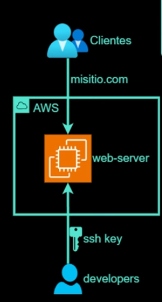

## Escenario

Una empresa te contrata para levantar un sitio web en su cuenta de AWS. Ellos quieres levantar
el servidor en una instancia de EC2. Te piden que instales un servidor web nginx, que ellos
luego van a configurar. Así que te piden abrir el puerto 80 y 22 a todo el mundo.

## Diagrama

## Componentes

- **EC2**: Instancia de EC2 con un servidor web nginx.
- **Security Group**: Grupo de seguridad que permite el tráfico HTTP y SSH.
- **Amazon EC2 Key Pairs**: Par de claves (Pública - Privada) para acceder a la instancia de EC2.

## Recursos de Terraform

## Conceptos

### Security Groups

Actuán como un firewall virtual, que controla el tráfico entrante y saliente de lo recursos a los que se asocia, es decir gestiona el tráfico a nivel de recurso.

- Permiten el tráfico
- Son Statefull
  Si entra, sale (Por el mismo puerto), independiente a las reglas de salida asociadas al recurso.

### Provider de Terraform

Plugin que interactua con un servicio o API específica de un proveedor de infraestructura.

### Recursos de Terraform

Unidad básica de configuración en terraform.

- **aws_instance**: Recurso para crear la instancia de EC2.
- **aws_security_group**: Recurso para crear el grupo de seguridad que permite el tráfico HTTP y SSH.
- **aws_key_pair**: Recurso para crear el par de claves para acceder a la instancia de EC2.

### Comandos de Terraform

- `terraform init`: Inicializa un directorio de trabajo
- `terraform plan`: Genera un plan de ejecucion
- `terraform apply`: Aplica los cambios definidos
- `terraform destroy`: Elimina los recursos

## Glosario

- **AMI**: Amazon Machine Image, imagen que se utiliza para crear instancias de EC2.
- **EC2**: Elastic Compute Cloud, servicio de AWS para crear y gestionar instancias virtuales.
- **Security Group**: Grupo de seguridad que controla el tráfico entrante y saliente de las instancias de EC2.
- **Key Pair**: Par de claves (Publica - Privada) que se utiliza para acceder a las instancias de EC2 de forma segura.
- **Nginx**: Servidor web de código abierto que se utiliza para servir contenidoo estático y dinámico.
- **SSH**: Secure Shell, protocolo de red que permite el acceso seguro a las instancias de EC2.
- **HTTP**: Protocolo de transferencia de hipertexto, utilizado para la comunicación entre servidores web y navegadores.
- **HTTPS**: Protocolo de transferencia de hipertexto seguro, utilizado para la comunicación segura entre servidores web y navegadores.
